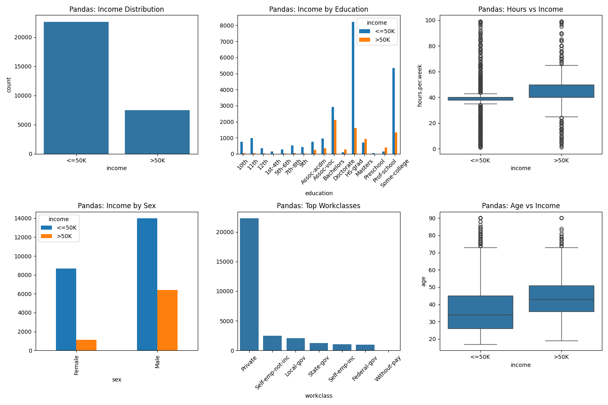
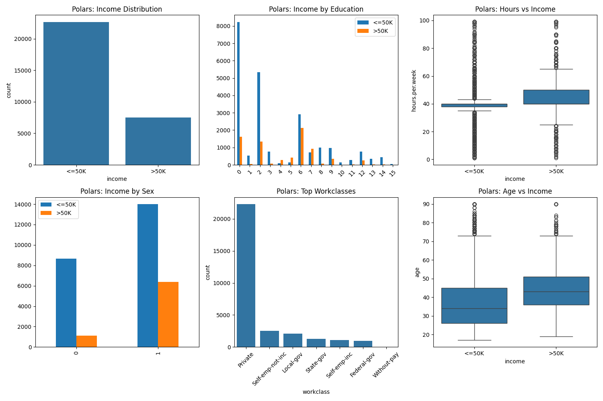
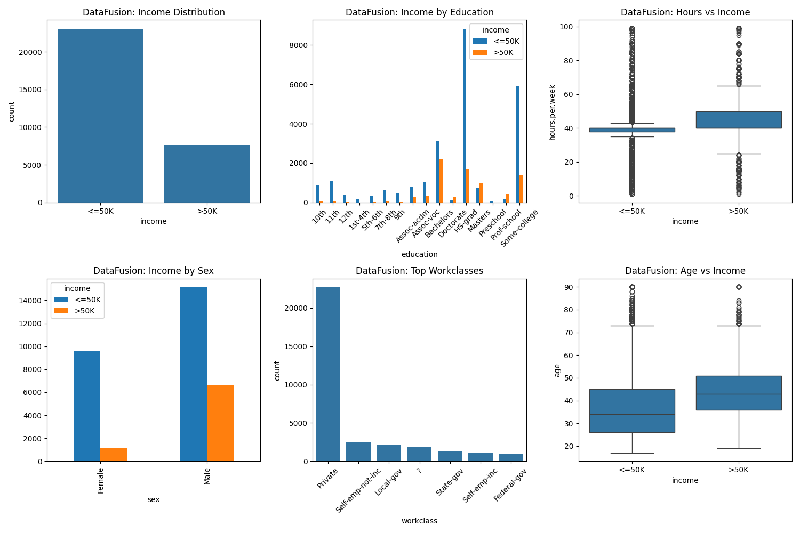

# Adult Income Pattern Analysis

This project analyzes the Adult Census Income dataset to identify patterns and relationships between various demographic factors (education, gender, workclass, age) and income levels. It demonstrates the use of multiple data processing libraries to compare performance and provides visual insights through different plotting libraries.

## 🚀 Features

- **Data Analysis**: Explores the relationship between income and education, gender, workclass, and age.
- **Multi-Library Implementation**: Implements the same analysis pipeline using:
  - **Pandas** (with PyArrow backend for optimized performance)
  - **Polars** (for high-performance DataFrame operations)
  - **DuckDB** (for SQL-based analytical processing)
  - **Apache DataFusion** (for query execution)
- **Visualization**: Provides two versions of the analysis:
  - Static charts using `matplotlib` and `seaborn`.
  - Interactive charts using `plotly`.
- **Performance Benchmarking**: Includes a benchmark suite to measure execution time and peak memory utilization across different libraries.

## 🛠️ Setup

This project uses `uv` for dependency management.

1. **Install uv** (if not already installed):
   ```bash
   curl -LsSf https://astral.sh/uv/install.sh | sh
   ```

2. **Sync dependencies**:
   ```bash
   uv sync
   ```

## 🏃 How to Run

### 1. Standard Analysis (Static Plots)
Run the main analysis using Matplotlib and Seaborn:
```bash
python main.py
```

### 2. Interactive Analysis (Plotly Plots)
Run the analysis using Plotly for interactive visualizations:
```bash
python main_plotly.py
```

### 3. Performance Benchmark
Run the benchmark to compare Pandas, Polars, DuckDB, and DataFusion:
```bash
python benchmark_libs.py
```

## 📊 Performance Benchmark Results

The following results were obtained by measuring the time taken to read, clean, and aggregate the dataset, as well as the peak memory usage.

| Library | Time (s) | Peak Memory (MB) |
| :--- | :--- | :--- |
| **Polars** | 0.3012 | 5.85 |
| **Pandas (PyArrow)** | 0.3927 | 8.05 |
| **DataFusion** | 0.4233 | 12.29 |
| **DuckDB** | 1.1324 | 21.02 |

*Note: Results may vary based on hardware and environment.*

## 🖼️ Benchmark Chart Outputs

Each benchmark run creates a PNG containing the same set of charts for that library: income distribution, income by education, hours per week by income, income by gender, top workclasses, and age by income.

### Pandas PyArrow Results



### Polars Results



### DuckDB Results


### DataFusion Results



## 📦 Dependencies

- `pandas` (with `pyarrow` backend)
- `polars`
- `duckdb`
- `datafusion`
- `matplotlib`
- `seaborn`
- `plotly`
