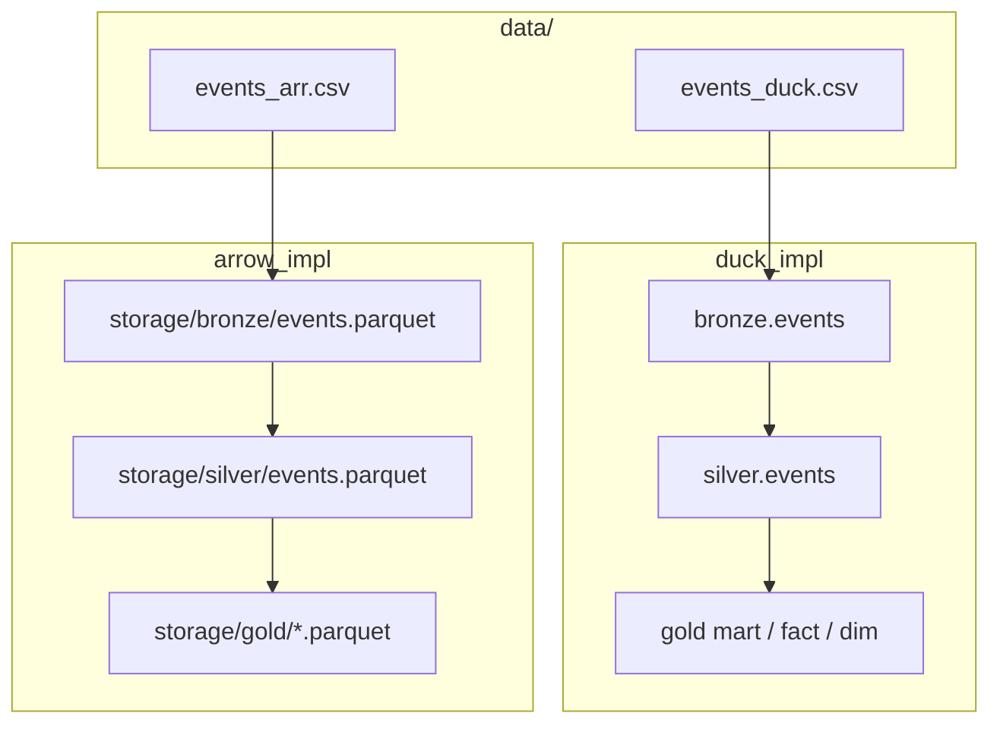

# Raw Data to Analytics: Medallion Architecture

Two side-by-side implementations of a **Bronze → Silver → Gold** lakehouse on the same dirty events dataset.

- **DuckDB** stores layers as schemas inside an embedded warehouse file.
- **PyArrow + Apache DataFusion** stores layers as open Parquet files.

Both pipelines ingest the same event schema, apply the same quality gates, and produce the same gold models: a daily channel mart, an orders fact table, and a user dimension.

---

## Implementations

| Path | Engine | Warehouse | Details |
|---|---|---|---|
| [`duck_impl/`](duck_impl/) | DuckDB (C++ vectorized SQL) | `duck_impl/storage/warehouse.duckdb` | [DuckDB README](duck_impl/README.md) |
| [`arrow_impl/`](arrow_impl/) | PyArrow + DataFusion (Rust) | `arrow_impl/storage/{bronze,silver,gold}/*.parquet` | [Arrow README](arrow_impl/README.md) |

Shared landing zone: [`data/`](data/)

- `data/events_duck.csv` — generated by `duck_impl/generate_dirty_data.py` (default 10M rows)
- `data/events_arr.csv` — generated by `arrow_impl/generate_dirty_data.py` (default 1M rows)

---

## Architecture



Each implementation follows the same medallion contract:

1. **Bronze** — schema-on-read, all columns as strings, plus `_ingested_at` and `_source_file`.
2. **Silver** — `TRY_CAST`, regex sanitization, casing normalization, and business quality gates.
3. **Gold** — consumption models:
   - `daily_channel_performance` — revenue and orders by date, country, channel
   - `fct_orders` — grain of a cleaned order
   - `dim_users` — lifetime activity and revenue per user

---

## Project Layout

```text
raw-data-to-analytics-medallion-arch-duckdb/
├── data/                          # Shared raw CSV landing zone
│   ├── events_duck.csv            # DuckDB generator output
│   └── events_arr.csv             # Arrow generator output
├── duck_impl/                     # DuckDB warehouse implementation
│   ├── storage/warehouse.duckdb   # bronze / silver / gold schemas
│   ├── generate_dirty_data.py
│   ├── load_bronze.py
│   ├── load_silver.py
│   ├── load_gold.py
│   ├── run_pipeline.py
│   └── README.md
├── arrow_impl/                    # PyArrow + DataFusion lakehouse
│   ├── storage/
│   │   ├── bronze/events.parquet
│   │   ├── silver/events.parquet
│   │   └── gold/*.parquet
│   ├── generate_dirty_data.py
│   ├── load_bronze.py
│   ├── load_silver.py
│   ├── load_gold.py
│   ├── run_pipeline.py
│   └── README.md
├── pyproject.toml
└── README.md                      # This file
```

---

## Prerequisites

- Python `>= 3.13`
- [`uv`](https://github.com/astral-sh/uv) (recommended)

```bash
cd raw-data-to-analytics-medallion-arch-duckdb
uv sync
```

Dependencies: DuckDB, PyArrow, DataFusion, Polars.

---

## Run

Generate raw CSVs first (skip if the files already exist under `data/`).

```bash
# DuckDB dataset (~10M rows → data/events_duck.csv)
uv run python duck_impl/generate_dirty_data.py

# Arrow dataset (default 1M rows → data/events_arr.csv)
uv run python arrow_impl/generate_dirty_data.py
```

Then run either pipeline end-to-end:

```bash
# DuckDB: CSV → warehouse.duckdb (bronze / silver / gold)
uv run python duck_impl/run_pipeline.py

# Arrow: CSV → Parquet lakehouse (bronze / silver / gold)
uv run python arrow_impl/run_pipeline.py
```

Step-by-step commands, quality rules, and query examples live in the implementation READMEs:

- [DuckDB pipeline](duck_impl/README.md)
- [PyArrow + DataFusion pipeline](arrow_impl/README.md)

---

## Shared Quality Gates (Silver)

Both engines reject rows that fail these checks:

| Field | Valid | Dropped |
|---|---|---|
| `event_date` | Date in `2024-01-01` … `2026-12-31` | malformed strings, sentinel `9999-12-31` |
| `country` | `US`, `UK`, `DE`, `FR`, `IN`, `JP` | unknown / numeric / null tokens |
| `channel` | `search`, `social`, `email`, `direct` | misspellings, empty values |
| `user_id` / `order_id` | positive integers | `GUEST_USER`, `ORD-ERR-999`, negatives |
| `revenue` | `0.0` … `10000.0` | `FREE`, `ERROR`, negatives, extreme outliers |

Country is uppercased, channel is lowercased, and non-numeric revenue characters are stripped before the decimal cast.

---

## DuckDB vs Arrow

| | DuckDB | PyArrow + DataFusion |
|---|---|---|
| Storage | One `.duckdb` catalog | Open Parquet per layer |
| Compute | DuckDB SQL | DataFusion SQL over Arrow |
| Catalog | In-database schemas | Directories under `storage/` |
| Best fit | Fast local warehouse | Engine-agnostic lakehouse files |

The same comparison table, with extra query snippets, is in the [Arrow README](arrow_impl/README.md#️-comparison-duckdb-vs-pyarrow--datafusion).
