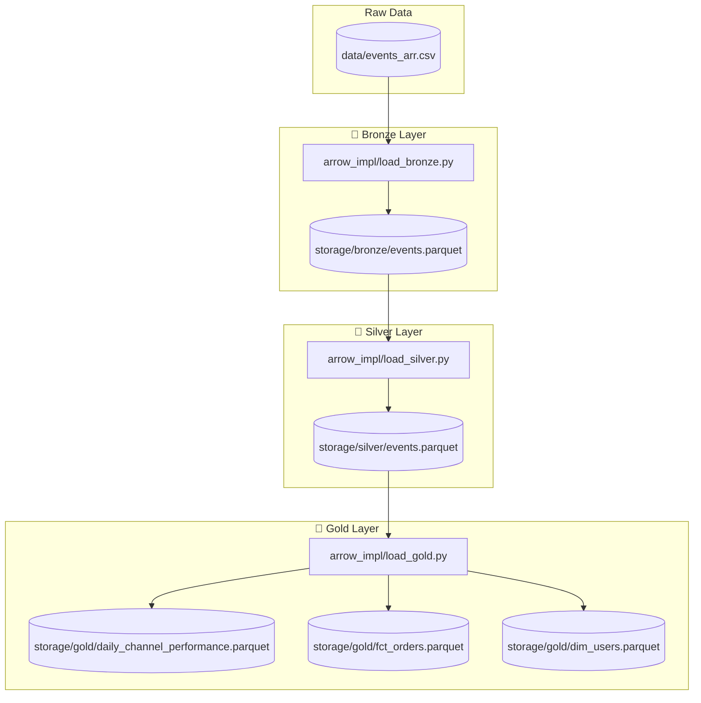

# 🏹 PyArrow & Apache DataFusion: Medallion Architecture Implementation

A cloud-native, open-standard data lakehouse pipeline implementation of the **Medallion Architecture (Bronze → Silver → Gold)** built using **PyArrow** and **Apache DataFusion** (Rust-based analytical engine).

This folder is one of two implementations in the repo. Project overview and the DuckDB counterpart: [root README](../README.md).

All data artifacts are stored in open **Apache Parquet** format under `arrow_impl/storage/`.

---

## 🏛 Architecture

Unlike monolithic embedded database files (e.g. SQLite or DuckDB `.duckdb`), this implementation adheres to the **open data lakehouse** paradigm where storage and compute are decoupled:



---

## 📂 Directory Layout

```text
arrow_impl/
├── storage/                                # Open Parquet Lakehouse Storage
│   ├── bronze/
│   │   └── events.parquet                  # Raw ingested events with metadata
│   ├── silver/
│   │   └── events.parquet                  # Cleaned, validated, typed records
│   └── gold/
│       ├── daily_channel_performance.parquet # Aggregated performance mart
│       ├── fct_orders.parquet              # Fact table (orders)
│       └── dim_users.parquet               # Dimension table (users)
├── generate_dirty_data.py                  # Writes ../data/events_arr.csv
├── load_bronze.py                          # Ingests CSV to Bronze Parquet
├── load_silver.py                          # Enforces data quality gates to Silver Parquet
├── load_gold.py                            # Models star schema and marts to Gold Parquet
├── run_pipeline.py                         # Single-command orchestrator
└── README.md
```

Repo-wide layout, shared `data/` landing zone, and the DuckDB implementation: [root README](../README.md).

---

## ⚡ Execution

From the **repository root**. Generate `data/events_arr.csv` first if it does not exist:

```bash
uv run python arrow_impl/generate_dirty_data.py
```

### Option 1: Run Full Pipeline Orchestration
```bash
uv run python arrow_impl/run_pipeline.py
```

### Option 2: Step-by-Step Execution

```bash
# 1. Ingest into Bronze Parquet
uv run python arrow_impl/load_bronze.py

# 2. Clean and Filter into Silver Parquet
uv run python arrow_impl/load_silver.py

# 3. Model Star Schema & Data Marts into Gold Parquet
uv run python arrow_impl/load_gold.py
```

---

## 🔍 How to Query with Apache DataFusion / PyArrow

### Using Apache DataFusion
```python
from datafusion import SessionContext

ctx = SessionContext()
ctx.register_parquet("mart", "arrow_impl/storage/gold/daily_channel_performance.parquet")

df = ctx.sql("""
    SELECT 
        country, 
        channel, 
        SUM(total_revenue) AS revenue, 
        SUM(total_orders) AS orders
    FROM mart
    GROUP BY country, channel
    ORDER BY revenue DESC
    LIMIT 5;
""")
df.show()
```

### Zero-Copy Metadata Inspection via PyArrow
```python
import pyarrow.parquet as pq

# Fast metadata scan without reading file contents
meta = pq.read_metadata("arrow_impl/storage/silver/events.parquet")
print(f"Total Rows: {meta.num_rows:,}")
print(f"Row Groups: {meta.num_row_groups}")
print(f"Schema:\n{meta.schema.to_arrow_schema()}")
```

---

## ⚖️ Comparison: DuckDB vs. PyArrow + DataFusion

| Feature | DuckDB Implementation | PyArrow + DataFusion Implementation |
|---|---|---|
| **Storage Engine** | Single embedded `.duckdb` catalog file | Open **Parquet** files (`storage/{layer}/*.parquet`) |
| **Interoperability** | Native DuckDB driver / Export to Parquet | Direct interoperability with Spark, Trino, Polars, DuckDB |
| **In-Memory Format** | DuckDB Vector format | **Apache Arrow** standard in-memory format |
| **Compute Engine** | C++ Vectorized execution engine | Rust-based Apache DataFusion execution engine |
| **Catalog / Schemas** | In-database schemas (`bronze`, `silver`, `gold`) | Directory-based lakehouse partitioning / schemas |
