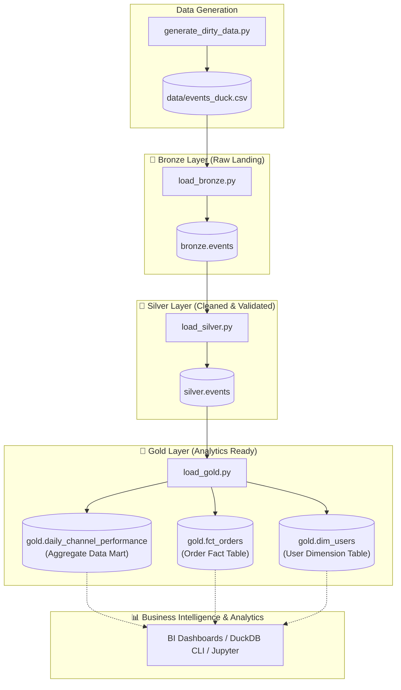

# 🥉 🥈 🥇 Medallion Architecture with DuckDB: Raw Data to Analytics

A high-performance, local data lakehouse pipeline implementing the **Medallion Architecture (Bronze → Silver → Gold)** using **Python** and **DuckDB**.

This folder is one of two implementations in the repo. Project overview and the Arrow/DataFusion counterpart: [root README](../README.md).

It ingests massive, dirty, schema-varying raw events (10M+ records), enforces strict data quality gates, and models analytical star schemas and aggregate data marts with sub-second OLAP query performance.

---

## 📑 Table of Contents
- [Architecture Overview](#-architecture-overview)
- [Pipeline Layers (Bronze, Silver, Gold)](#-pipeline-layers)
  - [Bronze Layer: Raw Landing](#1-bronze-layer-raw-landing)
  - [Silver Layer: Cleansed & Validated](#2-silver-layer-cleansed--validated)
  - [Gold Layer: Analytics & Dimensional Modeling](#3-gold-layer-analytics--dimensional-modeling)
- [Synthetic Dirty Data Generation](#-synthetic-dirty-data-generation)
- [Project Structure](#-project-structure)
- [Prerequisites & Setup](#-prerequisites--setup)
- [Running the Pipeline](#-running-the-pipeline)
- [Example Analytical Queries](#-example-analytical-queries)
- [Key Design Decisions & Performance Benefits](#-key-design-decisions--performance-benefits)

---

## 🏛 Architecture Overview

The pipeline organizes data into three distinct schemas within an embedded DuckDB database (`storage/warehouse.duckdb`):



---

## 🔄 Pipeline Layers

### 1. 🥉 Bronze Layer (Raw Landing)
- **Script**: [`load_bronze.py`](load_bronze.py)
- **Table**: `bronze.events`
- **Purpose**: Fast, non-blocking ingestion of raw files into the warehouse without data loss or schema-inference failures.
- **Key Strategy**:
  - Uses DuckDB's vectorized `read_csv` with `all_varchar=True`. Dirty entries (such as non-numeric IDs, corrupt date strings, or currency symbols) never break the ingestion.
  - Appends lineage and audit metadata:
    - `_ingested_at`: UTC timestamp of the ingestion job.
    - `_source_file`: Original file name (`events_duck.csv`).

### 2. 🥈 Silver Layer (Cleansed & Validated)
- **Script**: [`load_silver.py`](load_silver.py)
- **Table**: `silver.events`
- **Purpose**: Cleans, standardizes, casts types, and filters out malformed or corrupt rows.
- **Transformations & Data Quality Gates**:
  - **Type Casting & Parsing**:
    - `TRY_CAST(event_date AS DATE)`: Prevents crashes on malformed date strings (`INVALID_DATE`, `2024/13/45`).
    - `TRY_CAST(user_id AS BIGINT)` & `TRY_CAST(order_id AS BIGINT)`: Drops non-integer tokens (`GUEST_USER`, `ORD-ERR-999`).
    - `REGEXP_REPLACE(revenue, '[^0-9.-]', '', 'g')`: Strips stray characters before casting to `DECIMAL(12, 2)`.
  - **Standardization**:
    - `UPPER(TRIM(country))`: Normalizes casing (e.g. `'us'` → `'US'`).
    - `LOWER(TRIM(channel))`: Normalizes channel names (e.g. `'EMail'` → `'email'`).
  - **Business Quality Gates (`WHERE` clause)**:
    - **Date Bounds**: `event_date BETWEEN DATE '2024-01-01' AND DATE '2026-12-31'` (eliminates sentinel dates like `9999-12-31`).
    - **Categorical Allowlist**: `country IN ('US', 'UK', 'DE', 'FR', 'IN', 'JP')` and `channel IN ('search', 'social', 'email', 'direct')`.
    - **Positive IDs**: `user_id > 0` and `order_id > 0`.
    - **Revenue Bounds**: `revenue BETWEEN 0.0 AND 10000.0` (eliminates negative revenues and corrupt outliers like `99999999.99`).
  - **Lineage Audit**: Carries forward `_ingested_at`, `_source_file`, and generates `_processed_at`.

### 3. 🥇 Gold Layer (Analytics & Dimensional Modeling)
- **Script**: [`load_gold.py`](load_gold.py)
- **Purpose**: Deliver consumption-ready models for reporting, dashboards, and machine learning.
- **Data Models**:
  1. **Aggregate Data Mart (`gold.daily_channel_performance`)**:
     - Pre-aggregated metrics grouped by `event_date`, `country`, and `channel`.
     - Metrics: `total_orders`, `unique_customers`, `total_revenue`, `avg_order_value`, `_updated_at`.
  2. **Fact Table (`gold.fct_orders`)**:
     - Granular transaction-level fact table for slice-and-dice analytics.
     - Columns: `order_id`, `user_id`, `event_date`, `country`, `channel`, `revenue`, `silver_processed_at`, `_loaded_at`.
  3. **User Dimension Table (`gold.dim_users`)**:
     - Customer profile and lifetime metrics.
     - Columns: `user_id`, `first_active_date`, `last_active_date`, `lifetime_orders`, `lifetime_revenue`, `_updated_at`.

---

## 🎲 Synthetic Dirty Data Generation

[`generate_dirty_data.py`](generate_dirty_data.py) utilizes DuckDB's in-memory engine to synthesize **10,000,000 rows** of raw event data directly to [`data/events_duck.csv`](../data/events_duck.csv).

To emulate real-world production data challenges, it injects ~5% dirty data across every field:

| Column | Valid Format | Simulated Dirty Anomalies (~5%) |
|---|---|---|
| `event_date` | `YYYY-MM-DD` (2024 to 2026) | `'INVALID_DATE'`, `'9999-12-31'`, `''`, `'2024/13/45'`, `'N/A'` |
| `country` | `US`, `UK`, `DE`, `FR`, `IN`, `JP` | Lowercase (`'us'`), `'UNKNOWN'`, `'123'`, `'XX'`, `'null'` |
| `channel` | `search`, `social`, `email`, `direct` | Misspellings (`'socail'`, `'searhh'`), casing (`'EMail'`), `'---'`, `NULL` |
| `user_id` | Positive integer (1 – 200,000) | `'-1'`, `'0'`, `'GUEST_USER'`, `'9999999999'` |
| `order_id` | Positive integer (1 – 900,000) | `'ORD-ERR-999'`, `'NULL'`, `'None'`, `'-999'` |
| `revenue` | Positive decimal ($0 – $10,000) | `'-50.00'`, `'FREE'`, `'99999999.99'`, `'ERROR'`, `'-10.50'` |

---

## 📂 Project Structure

```text
duck_impl/
├── storage/
│   └── warehouse.duckdb            # Embedded DuckDB file (bronze, silver, gold)
├── generate_dirty_data.py          # Writes ../data/events_duck.csv (~10M rows)
├── load_bronze.py                  # Ingests CSV into bronze.events
├── load_silver.py                  # Cleans, casts, and filters into silver.events
├── load_gold.py                    # Star schema and aggregate marts
├── run_pipeline.py                 # Bronze → Silver → Gold orchestrator
└── README.md
```

Repo-wide layout, shared `data/` landing zone, and the Arrow implementation: [root README](../README.md).

---

## ⚙️ Prerequisites & Setup

- **Python**: `>= 3.13`
- **Package Manager**: Recommended using [`uv`](https://github.com/astral-sh/uv) (or standard `pip`)
- **DuckDB**: `>= 1.5.5`

### Installation

From the **repository root**:

```bash
cd raw-data-to-analytics-medallion-arch-duckdb
uv sync
```

*(Alternatively, using standard Python venv)*:
```bash
python3 -m venv .venv
source .venv/bin/activate
pip install "duckdb>=1.5.5"
```

---

## 🚀 Running the Pipeline

From the **repository root**, generate data then run the pipeline:

```bash
# Full orchestration
uv run python duck_impl/generate_dirty_data.py   # optional if data/events_duck.csv exists
uv run python duck_impl/run_pipeline.py
```

### Step 0: Generate Dirty Data (optional if `data/events_duck.csv` already exists)
```bash
uv run python duck_impl/generate_dirty_data.py
```
Writes ~10 million rows to `data/events_duck.csv`.

### Step 1: Ingest into Bronze Layer
```bash
uv run python duck_impl/load_bronze.py
```
- Creates `duck_impl/storage/warehouse.duckdb` and the `bronze` schema.
- Loads raw CSV with 100% varchar fidelity + audit timestamps.

### Step 2: Clean and Promote to Silver Layer
```bash
uv run python duck_impl/load_silver.py
```
- Applies regex cleansing, type casting, date range validation, and categorical filtering.
- Rejects corrupt rows and logs the filter delta.

### Step 3: Build Gold Analytics Models
```bash
uv run python duck_impl/load_gold.py
```
- Populates `gold.daily_channel_performance`, `gold.fct_orders`, and `gold.dim_users`.

---

## 📈 Example Analytical Queries

You can query the DuckDB warehouse using the DuckDB CLI or through Python:

### Option A: Python Quick Query

```python
import duckdb

con = duckdb.connect("duck_impl/storage/warehouse.duckdb", read_only=True)

# 1. Top 5 Revenue Channels by Country
query = """
SELECT 
    country,
    channel,
    SUM(total_revenue) AS total_revenue,
    SUM(total_orders) AS total_orders
FROM gold.daily_channel_performance
GROUP BY country, channel
ORDER BY total_revenue DESC
LIMIT 5;
"""
print(con.execute(query).df())
con.close()
```

### Option B: DuckDB Interactive CLI

```bash
duckdb duck_impl/storage/warehouse.duckdb
```

```sql
-- Inspect high-value repeat customers
SELECT 
    user_id,
    lifetime_orders,
    lifetime_revenue,
    first_active_date,
    last_active_date
FROM gold.dim_users
WHERE lifetime_orders >= 5
ORDER BY lifetime_revenue DESC
LIMIT 10;
```

---

## 💡 Key Design Decisions & Performance Benefits

1. **Embedded In-Process Engine**:
   - DuckDB operates directly inside the Python process with zero client-server network overhead, executing analytical queries across millions of rows in milliseconds.
2. **Resilient Schema-on-Read Ingestion**:
   - By loading Bronze data with `all_varchar=True`, the ingestion never crashes due to unexpected data format anomalies in upstream systems.
3. **Graceful Quality Enforcement with `TRY_CAST`**:
   - Rather than halting the ETL pipeline on bad records, `TRY_CAST` evaluates invalid strings to `NULL`, allowing declarative `WHERE` clause filters to clean the data deterministically.
4. **Zero-Copy & Columnar Efficiency**:
   - Columnar data format in `warehouse.duckdb` allows selective column projection and vectorized instruction pipelines (SIMD), drastically reducing memory and CPU usage compared to row-oriented databases.
5. **Data Lineage & Traceability**:
   - Every layer retains audit timestamps (`_ingested_at`, `_processed_at`, `_loaded_at`) and origin file identifiers (`_source_file`) for full debugging and compliance capability.
