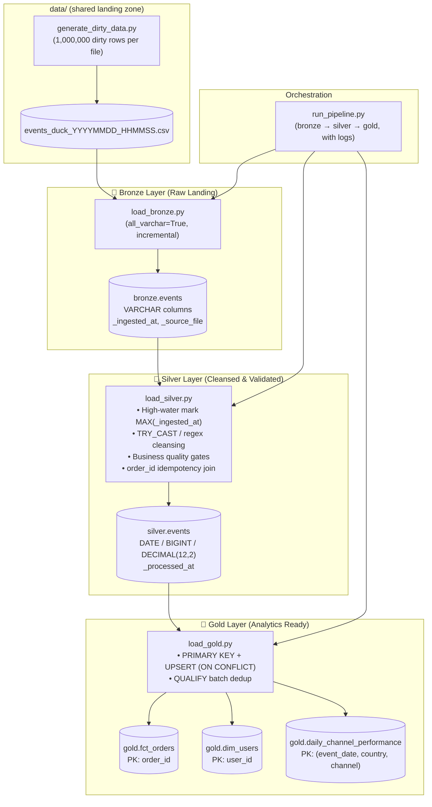

# 🥉 🥈 🥇 DuckDB Medallion Warehouse — Incremental (v2)

A **rerunnable, incremental** DuckDB implementation of the Bronze → Silver → Gold lakehouse. It is the DuckDB counterpart of [`arrow_impl_v2`](../arrow_impl_v2/), which keeps the same pipeline semantics over open Parquet files using PyArrow + DataFusion.

Where the base [`duck_impl`](../duck_impl/) rebuilds every layer with `CREATE OR REPLACE TABLE` on each run, v2 only processes **new** data and stores all state in one persistent database file:

- `storage/warehouse.duckdb` — single embedded DuckDB catalog containing the `bronze`, `silver`, and `gold` schemas
- `logs/pipeline_YYYYMMDD.log` — daily execution logs written by the orchestrator

Re-running the pipeline is safe and cheap: already-landed CSVs are skipped, Silver only advances beyond its high-water mark, and Gold models use primary keys + `ON CONFLICT` upserts so rows are never duplicated.

---

## Architecture



---

## Layout

```text
duck_impl_v2/
├── storage/
│   └── warehouse.duckdb            # persistent DuckDB file (bronze / silver / gold schemas)
├── logs/                           # daily pipeline logs (pipeline_YYYYMMDD.log)
├── generate_dirty_data.py          # writes data/events_duck_<timestamp>.csv (~1M rows)
├── load_bronze.py                  # lands only new events_duck_*.csv files
├── load_silver.py                  # promotes Bronze rows past the Silver watermark
├── load_gold.py                    # incremental UPSERT models with primary keys
├── run_pipeline.py                 # bronze → silver → gold orchestrator (with logs)
└── README.md
```

---

## Run

From the repository root:

```bash
# 1. Generate a timestamped raw CSV into ../data/ (optional if one already exists)
uv run python duck_impl_v2/generate_dirty_data.py

# 2. Land new CSVs → Bronze, promote → Silver, model → Gold
uv run python duck_impl_v2/run_pipeline.py
```

Individual stages can be run directly:

```bash
uv run python duck_impl_v2/load_bronze.py
uv run python duck_impl_v2/load_silver.py
uv run python duck_impl_v2/load_gold.py
```

Rerunning the pipeline after a successful run is a no-op for Bronze/Silver (no new files, no rows past the watermark) and safely refreshes Gold through upserts:

```bash
uv run python duck_impl_v2/run_pipeline.py
```

---

## 🔔 Failure Alerts via HTTP Health Endpoint

The orchestrator pings a monitoring dashboard at run start, on stage failure,
and on successful completion. Configure the endpoint with an environment
variable (Healthchecks.io-style ping URLs, Uptime Kuma push monitors, or any
HTTP endpoint that accepts POSTs):

| Env Variable | Description |
|---|---|
| `PIPELINE_HEALTH_URL` | Base ping URL, e.g. `https://hc-ping.com/<uuid>`. Empty/unset = alerts disabled. |
| `PIPELINE_HEALTH_TIMEOUT` | Request timeout in seconds (default: `10`). |

Signals sent by [`run_pipeline.py`](run_pipeline.py):

| Signal | Endpoint | Meaning |
|---|---|---|
| Start | `POST <url>/start` | run began (with `run_id`) |
| Failure | `POST <url>/fail` | a stage failed (stage, error, elapsed included in JSON body) |
| Success | `POST <url>` | run completed (total elapsed included in JSON body) |

```bash
# Example with Healthchecks.io
PIPELINE_HEALTH_URL="https://hc-ping.com/your-uuid" \
    uv run python duck_impl_v2/run_pipeline.py
```

Health pings are best-effort: if the URL is unset or the endpoint is
down, the pipeline logs a warning and continues. The alerting logic lives in
[`health.py`](health.py) (`notify_start`, `notify_success`, `notify_failure`).

---

## Synthetic Dirty Data Generation

[`generate_dirty_data.py`](generate_dirty_data.py) uses DuckDB's in-memory engine to synthesize **1,000,000 rows** per invocation and streams them into a timestamped `data/events_duck_YYYYMMDD_HHMMSS.csv` (the filename timestamp gives each batch a unique landing identity for Bronze deduplication).

Each field carries ~5% dirty values, mirroring the anomaly vocabulary of the other implementations:

| Column | Valid Format | Simulated Dirty Anomalies (~5%) |
|---|---|---|
| `event_date` | `YYYY-MM-DD` (2024 to 2026) | `'INVALID_DATE'`, `'9999-12-31'`, `''`, `'2024/13/45'`, `'N/A'` |
| `country` | `US`, `UK`, `DE`, `FR`, `IN`, `JP` | `'us'`, `'UNKNOWN'`, `'123'`, `'XX'`, `'null'` |
| `channel` | `search`, `social`, `email`, `direct` | `'socail'`, `'searhh'`, `'EMail'`, `'---'`, `NULL` |
| `user_id` | Positive integer (1 – 200,000) | `'-1'`, `'0'`, `'GUEST_USER'`, `'9999999999'` |
| `order_id` | Positive integer (1 – 900,000) | `'ORD-ERR-999'`, `'NULL'`, `'None'`, `'-999'` |
| `revenue` | Positive decimal ($0 – $10,000) | `'-$50.00'`, `'FREE'`, `'99999999.99'`, `'ERROR'`, `'$-10.50'` |

---

## Pipeline Stages

### 1. 🥉 Bronze Layer (`load_bronze.py`)

**Goal**: land every new raw CSV exactly once, with full string fidelity.

- Scans `data/` for `events_duck_*.csv` files.
- Asks the persistent `bronze.events` table for the distinct `_source_file` values already ingested and only reads files it has never seen.
- Ingests each new file with `read_csv(..., all_varchar=TRUE)` so corrupt tokens never break the load.
- Records lineage per row:
  - `_ingested_at` — UTC `CURRENT_TIMESTAMP` default when the row is inserted
  - `_source_file` — the CSV file name (used as the dedupe key on reruns)

```sql
CREATE TABLE IF NOT EXISTS bronze.events (
    event_date VARCHAR,
    country    VARCHAR,
    channel    VARCHAR,
    user_id    VARCHAR,
    order_id   VARCHAR,
    revenue    VARCHAR,
    _ingested_at TIMESTAMP DEFAULT CURRENT_TIMESTAMP,
    _source_file  VARCHAR
);
```

### 2. 🥈 Silver Layer (`load_silver.py`)

**Goal**: promote only the Bronze rows that arrived after the previous run, cleaning and validating them.

- Creates `silver.events` if needed (typed schema below).
- Computes the **high-water mark** `MAX(_ingested_at)` from Silver; on a first run the filter degrades to "all Bronze rows".
- Cleans the candidate Bronze rows with `TRY_CAST`, `UPPER(TRIM(...))`, `LOWER(TRIM(...))`, and `REGEXP_REPLACE(revenue, '[^0-9.-]', '', 'g')`.
- Applies the quality gates (see [Data Quality Gates](#-data-quality-gates)).
- **Idempotency check**: `LEFT JOIN silver.events` on `order_id` and inserts only orders that are not already in Silver, so re-running never duplicates rows.
- Adds `_processed_at = CURRENT_TIMESTAMP` to every promoted row.

```sql
CREATE TABLE IF NOT EXISTS silver.events (
    event_date DATE,
    country    VARCHAR,
    channel    VARCHAR,
    user_id    BIGINT,
    order_id   BIGINT,
    revenue    DECIMAL(12, 2),
    _ingested_at  TIMESTAMP,
    _source_file  VARCHAR,
    _processed_at TIMESTAMP DEFAULT CURRENT_TIMESTAMP
);
```

### 3. 🥇 Gold Layer (`load_gold.py`)

**Goal**: deliver consumption-ready models that stay correct across incremental reruns using primary keys and upserts.

- `ensure_table_with_pk()` inspects `information_schema.table_constraints`; if a legacy table exists without its primary key it is dropped and recreated (avoids `ON CONFLICT` errors on a stale schema).

**Model A — `gold.fct_orders`** (fact table, `PRIMARY KEY (order_id)`):

- Only Silver rows newer than the last loaded `silver_processed_at` watermark are candidates.
- `QUALIFY ROW_NUMBER() OVER (PARTITION BY order_id ORDER BY _processed_at DESC, event_date DESC) = 1` keeps one row per order inside the batch.
- An anti-join against existing fact rows guarantees no `order_id` is inserted twice.

**Model B — `gold.dim_users`** (dimension, `PRIMARY KEY (user_id)`):

- Aggregates every user's lifetime metrics from Silver: `MIN/MAX(event_date)`, `COUNT(DISTINCT order_id)`, `ROUND(SUM(revenue), 2)`.
- Upserts with `ON CONFLICT (user_id) DO UPDATE`, merging date ranges with `LEAST`/`GREATEST`.

**Model C — `gold.daily_channel_performance`** (aggregate mart, composite `PRIMARY KEY (event_date, country, channel)`):

- Daily per-country/channel metrics: `total_orders`, `unique_customers`, `total_revenue`, `avg_order_value`.
- Upserts with `ON CONFLICT (event_date, country, channel) DO UPDATE`.

```sql
-- Model A (fact)
CREATE TABLE IF NOT EXISTS gold.fct_orders (
    order_id BIGINT PRIMARY KEY,
    user_id  BIGINT,
    event_date DATE,
    country  VARCHAR,
    channel  VARCHAR,
    revenue  DECIMAL(12, 2),
    silver_processed_at TIMESTAMP,
    _loaded_at TIMESTAMP DEFAULT CURRENT_TIMESTAMP
);

-- Model B (user dimension)
CREATE TABLE IF NOT EXISTS gold.dim_users (
    user_id BIGINT PRIMARY KEY,
    first_active_date DATE,
    last_active_date  DATE,
    lifetime_orders BIGINT,
    lifetime_revenue DECIMAL(12, 2),
    _updated_at TIMESTAMP DEFAULT CURRENT_TIMESTAMP
);

-- Model C (aggregate mart)
CREATE TABLE IF NOT EXISTS gold.daily_channel_performance (
    event_date DATE,
    country VARCHAR,
    channel VARCHAR,
    total_orders BIGINT,
    unique_customers BIGINT,
    total_revenue DECIMAL(12, 2),
    avg_order_value DECIMAL(12, 2),
    _updated_at TIMESTAMP DEFAULT CURRENT_TIMESTAMP,
    PRIMARY KEY (event_date, country, channel)
);
```

---

## 🛡 Data Quality Gates

| Field | Transformation / Rule | Effect |
|---|---|---|
| `event_date` | `TRY_CAST(... AS DATE)` + `BETWEEN DATE '2024-01-01' AND DATE '2026-12-31'` | drops malformed dates and sentinels like `9999-12-31` |
| `country` | `UPPER(TRIM(...))` + allowlist `('US','UK','DE','FR','IN','JP')` | normalizes casing, drops junk tokens |
| `channel` | `LOWER(TRIM(...))` + allowlist `('search','social','email','direct')` | normalizes misspellings/casing, drops blanks |
| `user_id` | `TRY_CAST(... AS BIGINT)` + `> 0` | drops non-integer tokens and non-positive ids |
| `order_id` | `TRY_CAST(... AS BIGINT)` + `> 0` | drops tokens like `ORD-ERR-999`, `NULL`, `None` |
| `revenue` | `REGEXP_REPLACE(..., '[^0-9.-]', '', 'g')` → `TRY_CAST(... AS DECIMAL(12,2))` + `BETWEEN 0.0 AND 10000.0` | strips currency symbols/text, drops negatives and outliers |

---

## Incremental vs. v1

| Aspect | `duck_impl/` (v1) | `duck_impl_v2/` |
|---|---|---|
| Bronze | `CREATE OR REPLACE` full reload | `INSERT` of only unprocessed CSVs (tracked by `_source_file`) |
| Silver | `CREATE OR REPLACE` over all Bronze | high-water mark on `MAX(_ingested_at)` + `order_id` anti-join |
| Gold | `CREATE OR REPLACE` from all Silver | persistent tables with `PRIMARY KEY`; `QUALIFY` dedup + `ON CONFLICT` upserts |
| Reruns | destructive rebuild each time | incremental, idempotent, no duplicates |

The PyArrow/DataFusion counterpart of this design lives in [`arrow_impl_v2/README.md`](../arrow_impl_v2/README.md).

---

## Example Analytical Queries

### Python Quick Query

```python
import duckdb

con = duckdb.connect("duck_impl_v2/storage/warehouse.duckdb", read_only=True)

# Top 5 revenue channels by country
con.execute("""
    SELECT country, channel,
           SUM(total_revenue) AS total_revenue,
           SUM(total_orders)  AS total_orders
    FROM gold.daily_channel_performance
    GROUP BY country, channel
    ORDER BY total_revenue DESC
    LIMIT 5
""").df()

con.close()
```

### High-value repeat customers

```sql
SELECT user_id,
       lifetime_orders,
       lifetime_revenue,
       first_active_date,
       last_active_date
FROM gold.dim_users
WHERE lifetime_orders >= 5
ORDER BY lifetime_revenue DESC
LIMIT 10;
```

### Inspect the watermark after reruns

```sql
SELECT MAX(_ingested_at)      AS last_bronze_watermark  FROM silver.events;
SELECT MAX(silver_processed_at) AS last_fact_watermark    FROM gold.fct_orders;
SELECT COUNT(*)               AS fact_rows               FROM gold.fct_orders;
```

---

## Key Design Decisions

1. **One persistent catalog, no rebuilds** — a single `storage/warehouse.duckdb` accumulates Bronze/Silver history while Gold stays current through upserts.
2. **File-name dedupe at Bronze** — `_source_file` tracking means re-running bronze never double-reads a CSV.
3. **Watermark-driven Silver** — `MAX(_ingested_at)` limits each run to genuinely new Bronze rows.
4. **PK-backed idempotent Gold** — `ON CONFLICT` upserts and `QUALIFY` deduplication make every Gold model rerunnable without duplicate facts or double-counted users.
5. **Graceful type enforcement** — `TRY_CAST` + `REGEXP_REPLACE` turn dirty tokens into filterable `NULL`s instead of crashing the pipeline.
6. **Full lineage** — `_ingested_at`, `_source_file`, `_processed_at`, `silver_processed_at`, `_loaded_at`, and `_updated_at` trace every row through the medallion flow.
